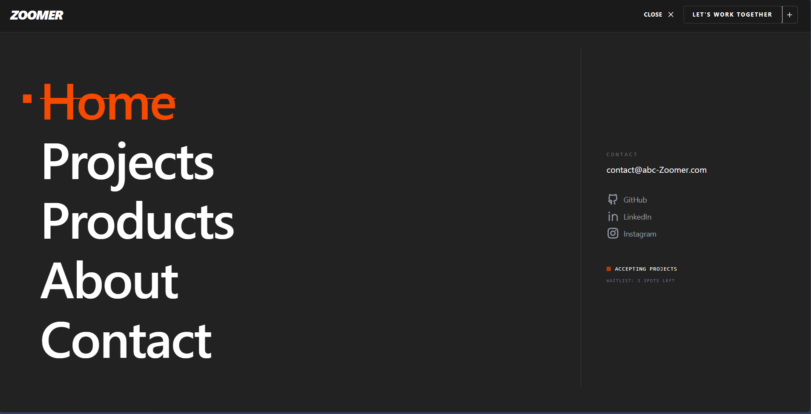

# 🚀 How I Learned React (My Growth Journey)

Welcome to my React journey — not just a collection of projects, but a **timeline of how I evolved as a developer**.

This repository reflects how I moved from **learning basics → building UI → handling real-world data → thinking like a developer**.

---

## 📌 Why This Repository Matters

When I started React, I didn’t want to stay stuck in “tutorial mode”.

So I followed one rule:

> 👉 *Build → Break → Fix → Improve*

This repo shows:

* 📈 My growth from beginner to confident React developer
* 🧠 How my thinking improved while solving problems
* 💻 Real projects that demonstrate practical skills

---

## 🧠 My Growth as a Developer

### 🟢 Phase 1: Foundation (Understanding React)

* JSX, components, props
* Basic layouts and UI structure

👉 Focus: *“How React works”*

---

### 🔵 Phase 2: State & Interactivity

* useState
* Event handling
* Dynamic UI updates

👉 Focus: *“Making UI interactive”*

---

### 🟡 Phase 3: Real Projects

* Built multiple small projects
* Started structuring apps properly
* Reusable components

👉 Focus: *“Thinking in components”*

---

### 🔴 Phase 4: Real-World Concepts

* useEffect & API calls
* Axios for data fetching
* Pagination & performance optimization
* Handling async data

👉 Focus: *“Building scalable & real apps”*

---

### 🟣 Phase 5: Advanced Routing & Architecture (Current Level 🚀)

* **React Router DOM** for Single Page Applications (SPA)
* Dynamic Routing with URL Parameters (`useParams`)
* Navigation state management (`useLocation`)
* Professional "Agency-Grade" UI/UX design

👉 Focus: *“Thinking like a Software Architect”*

---

## 🛠️ Tech Stack

* ⚛️ React.js
* 🛣️ React Router DOM (Navigation)
* 🎨 Tailwind CSS
* 📦 Vite
* 🧠 JavaScript (ES6+)
* 🌐 Axios (API handling)
* 💾 LocalStorage
* ⚡ Lucide React (Iconography)

---

## 📂 Projects Included

### 📝 1. Note Manager

A simple yet important project where I learned **state + persistence**.

**✨ Features:**

* Add & delete notes
* Data stored using localStorage
* Responsive UI

**🧠 What I Learned:**

* State management (useState)
* Form handling
* LocalStorage integration

---

### 🎴 2. Card Components

Focused on building **reusable UI components**.

**✨ Features:**

* Clean and modular UI
* Responsive design

**🧠 What I Learned:**

* Props usage
* Component reusability
* UI structuring

---

### 🌐 3. Website UI (website-1)

A multi-section responsive website layout.

**✨ Features:**

* Structured layout
* Tailwind-based styling

**🧠 What I Learned:**

* Layout design
* Component hierarchy
* Responsive thinking

---

### 🖼️ 4. Image Gallery App

Working with **real API data + pagination**.

**✨ Features:**

* Fetch images from API (Picsum)
* Pagination system (Next / Prev)
* Interactive UI with hover effects
* Click image → open full resolution
* Responsive grid layout

**🧠 What I Learned:**

* useEffect with dependencies
* Axios for API calls
* Handling async data
* Performance optimization using pagination
* Avoiding unnecessary re-renders

---

### ⚡ 5. Zoomer Digital Studio (Latest 🚀)

My most advanced project yet — a professional studio clone focusing on **SPA Architecture**.

**✨ Features:**

* **Full-Screen Navigation**: A complex overlay menu system.
* **Dynamic Product Routes**: Individual detail pages generated via URL parameters.
* **Active Link Tracking**: Menu items that know where you are on the site.
* **High-End UI**: Premium dark mode aesthetic with bold typography.

**🧠 What I Learned:**

* Implementing `BrowserRouter`, `Routes`, and `Route`.
* Dynamic segment matching with `:productId`.
* Using `useLocation` to drive UI logic.
* Handling complex library exports (Lucide) and Vite build issues.

---

## 📸 Screenshots

> **Zoomer Digital Studio (website-2)**
<<<<<<< HEAD
> 
=======
> 
>>>>>>> 7a6dcad56297885f346bd859c9308b59c52c453f

> **Image Gallery App**
> 

> **Website-1 UI**
> 

> **Note Manager**
> 

---

## 📈 Learning Timeline

* 📅 Day 1–2 → JSX, Components
* 📅 Day 3–4 → Props & State
* 📅 Day 5–7 → Built small projects
* 📅 Day 8–10 → API integration, useEffect, Axios
* 📅 Day 11+ → React Router DOM, Dynamic Routes, SPAs
* 📅 Current → Building agency-level digital experiences

---

## ⚡ Challenges I Faced (and Overcame)

### 🔴 Understanding State Updates
Initially confusing how React re-renders components.
✅ Learned how state drives UI and triggers re-renders.

### 🔴 Navigation & Routing
Moving from state-based page switching to a real Router.
✅ Mastered URL-based navigation and deep linking.

### 🔴 Handling Async Data
API calls and useEffect were tricky at first.
✅ Understood dependency arrays and data flow.

### 🔴 Performance & Debugging
Handling module syntax errors and Vite caching.
✅ Learned to use `--force` flags and case-sensitive library imports.

---

## 🔗 Future Improvements

* 🌐 Convert projects into MERN stack
* 🔐 Add authentication (Firebase/Auth0)
* 🎨 Add Framer Motion for premium animations
* 🚀 Deploy all projects to Vercel/Netlify
* 📱 Mobile-first optimization for all apps

---

## 🌍 Live Demo

* ⚡ **Zoomer Studio**: https://basic-web-routing.netlify.app/
* 📸 Mini-Random-Gallery: https://mini-random-gallery.netlify.app/
* 📝 Note Manager: https://mini-note-manager.netlify.app/
* 🌐 Website UI: https://basic-web-design-1.netlify.app

---

## 🤝 Connect With Me

* 💼 GitHub: https://github.com/dhruvaparnathi
* 🔗 LinkedIn: https://www.linkedin.com/in/dhruv-aparnathi-506b58306/

---

## ⭐ If You Like This Repo

Give it a ⭐ — it motivates me to build more and go further!

---

## ✨ Final Note

This repository is more than code.

It shows:

* where I started
* how I improved
* and where I’m heading next

👉 *From learning React → to building real-world applications.*

🚀 And this is just the beginning.